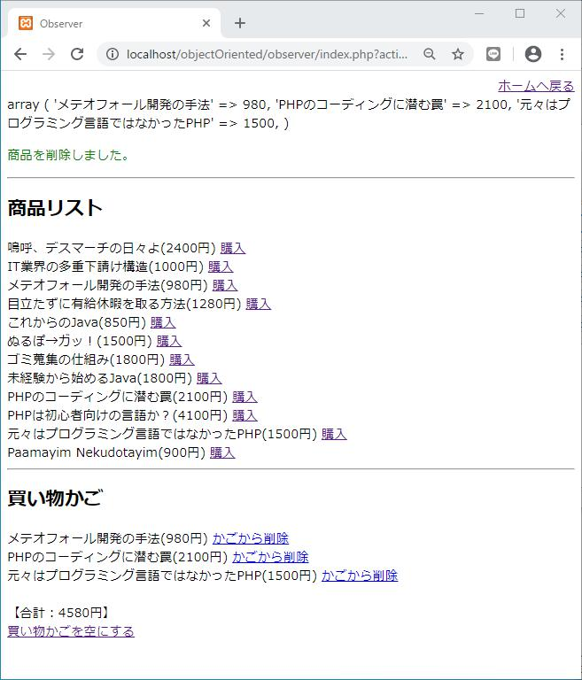

#  概要

オブジェクト指向プログラミングのサンプルソースコードです。
初心者でも簡単に動作環境を構築できるように意識して作りました。

# はじめに

当アプリケーションは、以前勤めていた会社で新人向けににオブジェクト指向プログラミングのGoFデザインパターンの教材として、休み中にコツコツつくったものをブラッシュアップしたものです。

すべてのパターンは網羅していませんが、比較的使用頻度の高いパターンについてサンプルを用意しています。それと、あくまで学習用の擬似的なものではありますが「本を販売するウェブサイト」としても機能するように制作しましたので、パターンの利用例としてのイメージを掴みやすいかと思います。

初心者でも簡単に動作環境を構築できるようにデータベースは使用せずApacheとPHPだけで動作する作りとなっています。ですのでXAMPPをインストール（もちろんApacheとPHPを設定していただいても構いません）するだけで動作し、必要となる諸々の設定は最低限に抑えました。
以下のリンク先のページを順に読み、記載の手順通りの操作をすれば一通りの学習ができます。

1. [XAMPPのインストール手順](./_readMe/installXampp.md)
2. [当アプリケーションをXAMPP上に構築する手順](./_readMe/buildApp.md)
3. [各デザインパターンの説明](./_readMe/designPattern.md)

# 画面キャプチャー

  

<small>※あくまでデザインパターンを学ぶための教材ですので、デザインはには凝らずにシンプルな作りにしました。</small>

以上