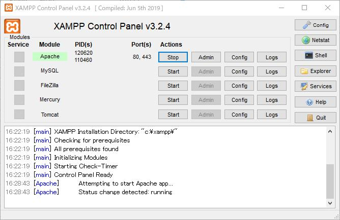
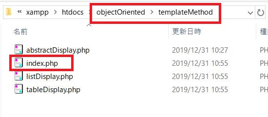

# 当アプリケーションをXAMPP上に構築する手順

※XAMPPのインストールが完了しており、「C:\xampp」にインストールされている前提とします。

1. GitHubのサイトから当アプリケーションのソースコードをダウンロードします。ここではzipファイルのダウンロードをしてみましょう。

2. ダウンロードしたzipファイルを解凍します。

3. 「C:\xampp\htdocs」配下に解凍したファイルを配置します。

4. 構築自体は以上で完了なのですが、実際にウェブサービスとして稼働させて軽く動作確認をしてみましょう。「C:\xampp\xampp-control.exe」という実行ファイルをクリックしてXAMPPのControl Panelを起動します。

5. Apacheを起動します。Apacheの「Start」ボタンをクリックしてください。

   

   

6. 起動できました。

   

7. 任意のウェブブラウザを起動してください、ここではChromeを使用しています。アドレスバーに「https://localhost/objectOriented/index.php」もしくは「https://127.0.0.1/objectOriented/index.php」と入力してみてください。以下の画面が表示されます。XAMPPできちんとした設定をすればエラーは出なくなりますが、今回は接続先が自分のPC(localhost)であることをしっかりと確認したうえで接続します。Chromeの場合だと「詳細設定」ボタンをクリックしてから、「localhostにアクセスする」をクリックしてください。もしくは"https"ではなく"http"で接続しても構いません。

    

8. 以下の画面が表示されます、まだログインをしていませんので、「ログイン画面へ」リンクをクリックしてログイン画面へ遷移しましょう。

   

9. ログイン情報を入力します。当アプリケーションは学習用のサンプルですから、認証情報は「ログインID:user01、パスワード:123456」の固定値としており、すでに入力欄に自動で値を設定していますので、そのまま「ログイン」ボタンをクリックしてください。

   <small>※ちなみにここではデザインパターンのFacadeを用いて実装しています。</small>

   

   

10. ログインが完了するとホーム画面が表示されます。画面上の各リンクをクリックするとそのデザインパターンを利用したページへと遷移する、という作りとなっています。

    
    
    
    
    ## ディレクトリ構成
    
    デザインパターンごとに別々に用意されたウェブページは、ソースコードのディレクトリ構造とも対応しています。(※Facadeはホーム画面一覧には記載がありませんが、ログイン処理を担当しています。)
    
     
    
    
    
    また、URLアドレスもソースコードが配置されているディレクトリと対応関係があります。下図はTemplete Methodのウェブページとソースコードの配置場所との対応を示したものです。
    
    
    
    
    
    

### その他のディレクトリ・ファイルについて

- _books：アプリで利用するサンプルデータ(本の情報)を格納したファイルをまとめたディレクトリ
- _common：使用頻度の高い共通処理・クラスをまとめたディレクトリ
- _readMe：README.mdでしようするコンテンツを格納したディレクトリ
- index.php：アプリのホーム画面
- README.md：本アプリの説明書き

以上

