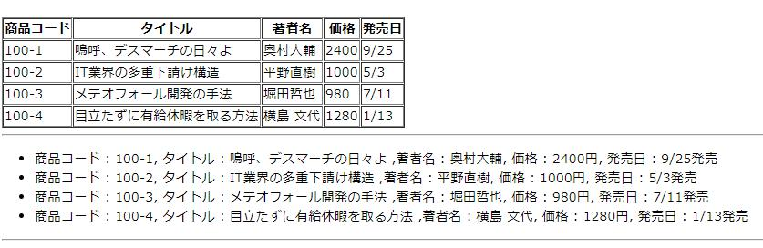
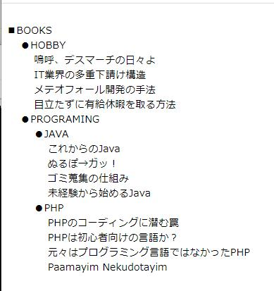
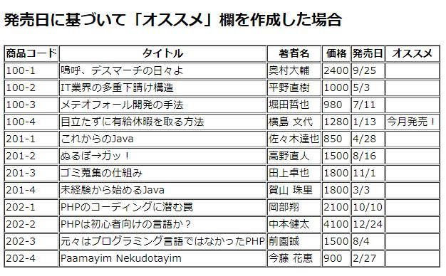
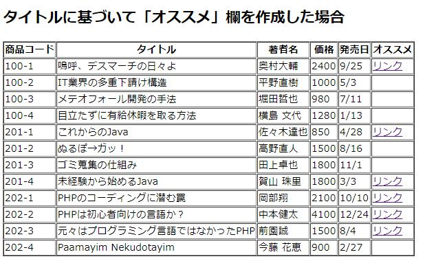
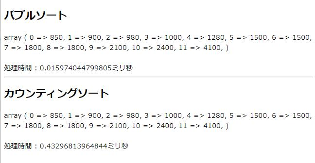
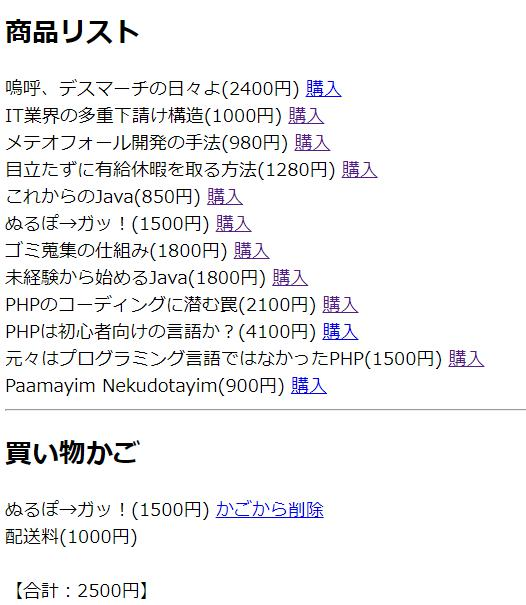
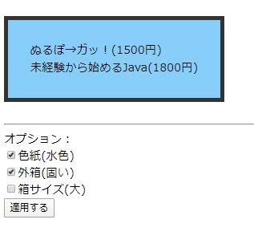
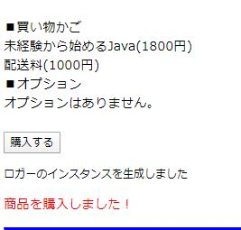
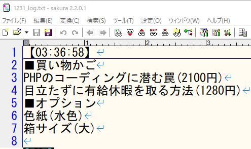

# 各デザインパターンの説明

## 注意事項

あくまで学習用に作った物なので、クロスサイトリクエストフォージェリ等に対する脆弱性があります。
ですので、実際の商用サービスなどでそのまま利用しないでください。


## もくじ

[Facade](#Facade)

[Template Method](#Template-Method)

[Factory Method](#Factory-Method)

[Iterator](#Iterator)

[Composite](#Composite)

[Strategy](#Strategy)

[Bridge](#Bridge)

[Observer](#Observer)

[Decorator](#Decorator)

[Singleton](#Singleton)


## Facade

#### 複雑な認証処理はシンプルに窓口１つで済ませよう

facadeとは"建物の正面"とか"窓口"といった意味です。役所の手続きやワークフローの申請などで複数の部署を巡る旅をすることがありますが、そういった煩雑な手続きを１つの窓口で全部やってしまおうという趣旨のデザインパターンです。

ユーザがログインする、という一連の処理の流れを掘り下げれば、Validation、Database Access、パスワードのハッシュ化など様々な処理が複雑に絡み合って成り立っている処理を、”ログイン”というひとつの抽象的な手続きでまとめられています。これがFacadeパターンの概念と一致します。


#### 各ファイルの説明

・index.html ‥ ログイン画面、IDとPasswordを入力するための画面。<br>
・login.php ‥ Facadeパターンの入り口に相当する部分、すごくシンプルな造りになっている。<br>
　└authManager.php ‥ ログインに関するごちゃごちゃとした処理をやるところ。<br>
　　├user.php ‥ ユーザ情報を取得するクラス、データベース未使用なので作りはすごく単純。<br>
　　├hash.php ‥ パスワードをハッシュ化するための機能を持つ。<br>
　　└session.php ‥ cookieにログイン中であるというフラグを持たせる。<br>
・logout.php ‥ ついでに作ったログアウト処理、cookieッキーの情報を消す。<br>


##  Template Method

#### ディスプレイのテンプレートを用意しよう

Template Methodパターンは最も基本となるデザインパターンです。当アプリケーションで本の情報を複数のフォーマットで表示するケースを例として挙げています。



Templateとはいわゆる"テンプレ"ですね、日本語では"鋳型"です。上図の「表のテンプレ」と「リストのテンプレ」を別々に定義していて、どちらを使うかは状況・用途によって使い分けれます。また別のフォーマットのテンプレを新規に追加するのも容易なデザインパターンですから、機能追加にも容易に対応できます。


#### 各ファイルの説明

・index.php ‥ テンプレートメソッドパターンを利用して本情報を画面上に表示する。<br>
　└abstractDisplay.php ‥ 画面表示機能を扱う抽象クラス。<br>
　　├tableDisplay.php ‥ テーブル形式で本の情報を表示する。<br>
　　└listDisplay.php ‥ リスト形式で本の情報を表示する。<br>


## Factory Method

#### ファイルから商品データを読み込もう

Factoryとは工場のことですね。当アプリケーションではファイルからデータを読み取る処理に使用しています。

工場で"ファイルの読み取り機"を製造するのですが、ファイルの種類が"CSV"か"JSON"かによって、"CSV読み取り機"か"JSON読み取り機"のどちらを製造するかが変わります。ただ、それらの"読み取り機"は中身が違っても使い方は同じ(readerInterface.phpで共通の定義をしている)なので、使い手は特に違いを気にせず使える(これがポリモーフィズムによる利点)という仕組みになっています。


#### 各ファイルの説明

・index.php ‥ 読み込んだファイルを表示する。<br>
　└factory.php ‥ 読み取り機を製造する工場のようなもの。<br>
　　└readerInterface.php ‥ 読み取り機のインターフェースクラス。<br>
　　　├csvReader.php ‥ CSV形式のファイルを読み込む読み取り機。<br>
　　　└jsonReader.php ‥ JSON形式のファイルを読み込む読み取り機。<br>


##  Iterator

####  商品データに対する反復操作で、商品の一覧を表示しよう

Iteratorとは"反復子"という意味なのですが、要は"繰り返すもの"とか"反復するもの"です。php,C#やjavaなどでforeach文が暗黙的にIteratorとして機能するので、気づかないうちに使ってたりします。商品リスト・顧客リスト・病院のカルテのリスト・アドレス帳などなど例を挙げれば切りがないですが、そういった繰り返し要素を持つものに対してループ処理を行う場合などに利用します。


#### 各ファイルの説明

・index.php ‥ イテレータパターンを利用して商品データを一覧で表示する。<br>
　├book.php ‥ 商品(本)を表すクラスです。※別ファイルの「_common/book.php」にあります<br>
　├bookIterator.php ‥ 商品(本)のリストを表すクラス。<br>
　└priceIterator.php ‥ 一定価格以上の商品(本)のリストを表すクラス。フィルターとしての機能する。<br>


## Composite

####  ツリー構造で商品データを表示しよう

compositeとは"複合物"とか"混合物"のことですが、このパターンの説明をするならフォルダーとファイルの関係が分かりやすいと思います。

例として当アプリケーションの一部のフォルダー・ファイル構成を挙げてみます

```
C:\xampp\htdocs\objectOriented
│  index.php
│  README.md
├─composite
│      abstractComponent.php
│      composite.php
│      index.php
│      leaf.php
└─singleton
   │  index.php
   │  logger.php
   │
   └─log
      1230_log.txt
      1231_log.txt
```

このように「フォルダーの中にフォルダーがある、そしてまたその中にフォルダーがあって、一緒にファイルもある」といった繰り返しのツリーのような構造になっています。こういったものを扱うときにCompositeパターンが利用できます。他の例ですと「営業所・部・課・そしてそこに所属する人」などもこのパターンを使って表現できます。

余談ですが、オブジェクト指向プログラミング自体が「人間主体の世界の捉え方」を考え方のベースにしていることもあって、プログラミングの世界でなく現実世界でも同様の構造をちょくちょく目にするかとと思います。自然界の中だとフラクタル構造とかホロン構造などに同様のパターンを見つけられるのではないかと思います。

当アプリケーションでは"本のジャンル"と"本"をツリー構造で表示するサンプルを用意しています。




#### 各ファイルの説明

・index.php ‥ コンポジットパターンを利用して商品データをツリー構造で表示する。<br>
　└abstractComponent.php ‥ これを継承して枝と葉を作るから、枝葉を同一視することができる。<br>
　　├composite.php ‥ 木構造の"枝"に相当するクラス。<br>
　　└leaf.php ‥ 木構造の"葉"に位置する葉に相当するクラス<br>


## Strategy

#### 戦略を切り替えよう

Strategyとは"戦略"とか”計略”といった意味を持ちます。戦争というシチュエーションだと、司令官が戦況によって"進軍"するか"撤退"するかを決定したりするわけですが、そういった「状況に応じた戦略の切り替え」を簡単に行えるのがこのパターンになります。

戦略そのものをまるっと交換して切り替えれる作りになっています、ちなみに別の戦略を追加するのも容易です。

当アプリケーションでは本の販売というシチュエーションで、２つの販売戦略の切り替えを行うサンプルを用意しました。販売戦略によって「オススメ」欄に表示する内容が異なります。
<small>※切り替えはランダムで行ってますので、画面を何度が更新(F5ボタンクリック)してもらうと切り替わります。</small>

 

- 発売日に基づいて「オススメ」欄を作成した場合
  →発売日が当月の場合、「今月発売!」とレコメンドを表示する。
- タイトルに基づいて「オススメ」欄を作成した場合
  →タイトルに特定の文字列を含む場合、別サイトへのリンクを表示する。


#### 各ファイルの説明

・index.php ‥ 各戦略の実行結果に基づき、オススメ欄に特定のメッセージを提示する。<br>
　└context.php[^1] ‥ 状況により切り替えられた戦略を利用する。<br>
　　└abstractStrategy.php ‥ 戦略の抽象クラス。<br>
　　　├releaseMonthStrategy.php ‥ 商品(本)の発売月に基づいた販売戦略。<br>
　　　└bookNameStrategy.php ‥ 商品(本)の名前に基づいた販売戦略。<br>

[^1]:Conxtexとは直訳すると「文脈」とか「環境」という意味ですが、プログラムにおいては**状況判断**とか**条件分岐時における判断材料**とか**前提条件**とか**背後関係**とか、そのようなニュアンスになります。


## Bridge

#### 機能と実装を繋げて、商品を並べ替えよう

Bridgeは"橋"です。"機能"と"実装"を分離する形でコーディングをして、それらの分離したものを"橋"で繋げる、といったデザインパターンです。

当アプリケーションでは商品を価格順に並べ替えるといった形でサンプルを用意しています。



並べ替えのアルゴリズムには"バブルソート(bubbleSort.php)"と"カウンティングソート(countingSort.php)"を用意しており、これが"機能"に相当します。そして実際に並べ替えを行うクラス(sorter.php)を前述のアルゴリズムと分離した状態で用意しており、これが"実装"に相当します。

ちなみに、容易に別の並べ替えのアルゴリズムを追加することができますので、余裕があれば試してみると良いでしょう。


#### 各ファイルの説明

・index.php ‥ ブリッジターンを利用して商品データをソート表示する。<br>
　├sorter.php ‥ ソート機能の実装クラス、実際のソート時に利用するクラス。<br>
　│ └sortTimer.php ‥  sorter.phpを継承したクラス。ソートに要した時間を計測する。<br>
　└sortInterface.php ‥ ソート機能(アルゴリズム)のインターフェイス。<br>
　　├bubbleSort.php ‥ バブルソートの機能(アルゴリズム)。<br>
　　└countingSort.php ‥ カウンティングソートの機能(アルゴリズム)。<br>


## Observer

#### 買い物かごの中身を観てみよう

Observerは"観察者"という意味です。当アプリケーションは本の販売サイトを模して作られてますので、本の購入のために「買い物かご」という機能があります。この買い物かご内に商品が入れられたときに"観察者"がそれを検知します。

「商品リスト」にある商品の「購入ボタン」をクリックすると、買い物かごに商品を入れることができます。そうすると観察者(deliveryCostListener.php)がそれを検知して、買い物かご内の商品の合計金額が3000円よりも安ければ配送料を追加します、3000円以上であれば配送料は無料です。



#### 各ファイルの説明

・index.php ‥ 買い物かごとしての機能をユーザに提供する。<br>
　└shoppingBasket.php ‥ 観測される対象の買い物かご、中に購入する商品を入れる。<br>
　　└cartListenerInterface.php ‥ 観測者のインターフェイス。<br>
　　　├loggingListener.php ‥ 買い物かごの変化を検知し、その中身を画面上に表示する。<br>
　　　└deliveryCostListener.php ‥ 買い物かごの変化を検知し、合計金額によっては配送料を課金する。<br>


## Decorator

#### 購入する商品を包装しよう

デコレーションケーキなどから分かるかとは思いますが、Decoratorは"装飾する人"です。

ケーキ・アイスのトッピングがイメージしやすいと思います。お客様の要望に応じて、”チョコチップを追加”、"キャラメルソースはなし"、"ナッツも追加"といった様に、飾り付けのある/なしに柔軟にに対応するイメージです。

当アプリケーションでは、先のObserverパターンで実装した買い物かご内の商品を、プレゼント用にラッピングする機能を実装しました。（といっても実際にリボンや包装紙でデコレーションするわけではなく、CSSを使って擬似的に表現しているだけですが…。あと、買い物かごが空だとこの機能は使えないです。）

オプションを選んで、「適用する」ボタンをクリックすればデコレーションできます。



#### 各ファイルの説明

・index.php ‥ 買い物かごの中の商品をオプションで包装する機能をユーザに提供する。<br>
・packInterface.php ‥ 包装のオプションについてのインターフェイス。<br>
　├plainPack.php ‥ 包装のオプションを適用する前の箱を表現するクラス。<br>
　└abstractPackDecorator.php ‥ 包装のオプションを扱う抽象クラス。<br>
　　├largePack.php ‥ 箱のサイズを大きくする。<br>
　　├cyanPack.ph ‥ 水色の紙で包装する。<br>
　　└hardPack.php ‥ 固い外箱に入れる。<br>


## Singleton

#### 商品の注文履歴をファイルに書き出そう

Singletonとは、トランプの持ち札で組札ができない孤立した札のことで"トランプの一枚札"を指します。

このパターンが適用されたクラスではインスタンスが１つしか生成されないことが保証されるので、アプリケーション全体で１つだけ稼働させたい機能に対して使います。

当アプリケーションでは、商品の購入時に購入履歴をファイルに書き出す処理に当パターンを用いるサンプルを用意しています。

 


<b>【備考】</b><u>Singletonは他のパターンと比べて理解しやすいですが、何かと批判が多いです。今回はサンプルということで使用していますが、実際は使い所が使い所が難しく、積極的に使うようなパターンではないと思います。</u>


#### 各ファイルの説明

・index.php ‥ 商品の購入時に購入履歴を残す機能を提供する。<br>
　├logger.php ‥ 購入履歴をファイルに書き出す。（Singletonとして実装）<br>
　└log ‥ 購入履歴を記したファイルのの出力先フォルダ。<br>


以上