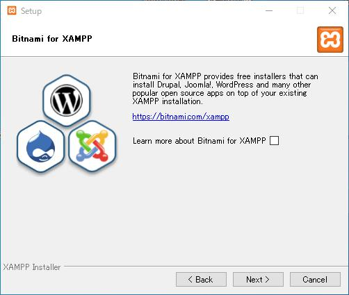
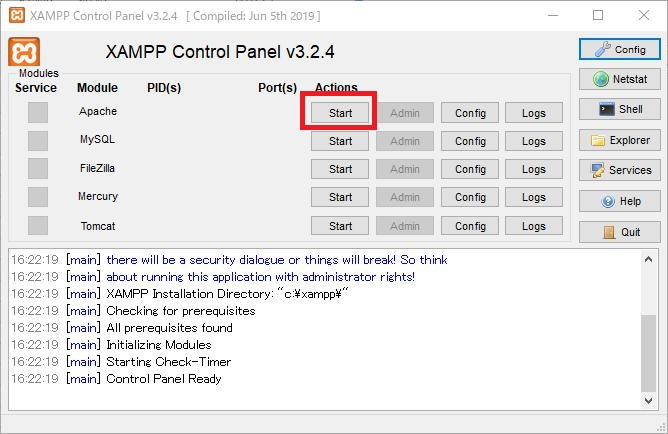

# XAMPPのインストール手順

## XAMPPとは？

Apache、MariaDB、PHP、Perlといったフリーのソフトウェアをパッケージとしてまとめたもので、これをインストールすると簡単にウェブサービスの開発環境を用意できます。前述の通り無料で使えますし、何よりも構築が簡単で楽です。私はPHPで開発したいときに重用させてもらってます。


## インストール手順

<small>※簡単に手順をまとめていますが、分かりにくいようでしたら他のまとめサイトがいっぱいありますので、そちらを検索されると良いかとおもいます。</small>


1. XAMPPの[ダウンロードサイト](https://www.apachefriends.org/jp/index.html)を開く。

2. 画面下部の「ダウンロード」の部分で使用しているOSに対応したバージョンをクリックする。ここではWindows向けのXAMPPでヴァージョン7.4.1をダウンロードします。

   

   

   

3. 自動でインストーラーがダウンロードされる。

   

   

4. ダウンロードしたインストーラーを実行する。インストールを続行するか聞かれるので「Yes」を選択する。

   

   

5. アクセスコントロールについての警告が出る。要は「C:\Program FIles」の配下にインストールするのは止めてねって事なんで、ざっと読んで「OK」をクリックします。

   

   

6. セットアップウィザードが開始されましたので「Next>」をクリックします。

   

   

7. どの機能をインストールするかしないかの設定なんだけど、今回は全部インストールするので特にチェックは外さずにそのまま「Next>」をクリックします。

   

   

8. インストール先のディレクトリを選択します。初期設定だと「C:\xampp」で、別にこのままで問題ないので特に設定は変更せずに「Next>」をクリックします。

   

   

9. 他のオープンソースアプリの紹介です。今は必要ないものなのでチェックを外してから「Next>」をクリックします。

   

   

10. ここまででインストールの準備が完了したので、「Next>」をクリックします。そうするとインストールが開始されます。

    

    

11. インストール中。

    

    

12. インストールが完了したので「Finish」をクリックします。

    

    

13. 最後に言語設定です、英語とドイツ語の選択肢がありますのでお好きなのを選択して「Save」をクリックしてください。残念ながら日本語はないです。

    

    

14. 以上でインストールは完了です。「C:\xampp」にフォルダが作成されているはずです。


##　起動


1. 「C:\xampp」にインストールした前提ですと、「C:\xampp\xampp-control.exe」という実行ファイルがあるはずなので、それをクリックしてxamppのコントロールパネルを起動します。

   <small>※この実行ファイルをのショートカットを作成してデスクトップ等に配置しておくと後々便利です。</small>

   

2. 試しにApacheを起動してみましょう、Apacheの「Start」ボタンをクリックしてみてください。

   

   

3. 起動できました。でも、もしかするとSkypeなどのアプリケーションをすでに立ち上げていると起動に失敗する場合もあります。使用するポート番号が重複するために失敗するのですが、ここでは詳細は省きます。そういったアプケーションを停止してから再度Apacheの起動を試みてください。

   

   

4. 実際にApacheが稼働していることを確認してみましょう。任意のウェブブラウザを起動してください、ここではChromeを使用しています。アドレスバーに「http://localhost」もしくは「http://127.0.0.1」と入力してみてください。以下の画面（ダッシュボード）が表示されるはずです。

   


## Hello, World!

ここまで来たらついでにPHPでHello, World!を作ってみましょう。

<small>※Hello Worldとは画面上に「Hello World!」という文字列を表示するだけの簡単なプログラムのことです。</small>


1. 「C:\xampp」にインストールした前提ですと、「C:\xampp\htdocs」というフォルダあるはずなので、その配下に、「helloworld.php」というファイルを作成します。

   

2. メモ帳などのテキストエディタで「helloworld.php」を開き、以下のソースコードを書き込みます。

   ```
   <?php
   echo "Hello, World!";
   ```

   

3. 変更を保存します。保存時の文字コードは「UTF-8」にします。

   

   

4. ウェブブラウザを起動し、アドレスバーに「http://localhost/helloworld.php」もしくは「http://127.0.0.1/helloworld.php」と入力してみてください。以下の画面のように先程プログラムで書いた文字列が表示されるはずです。（※事前にApacheを起動しておく必要があります。）

   

   

5. 以上です。Hello Worldは簡単ではありますがプログラムですから、ここまでの段階で"プログラミングを書いて実行した"ということになります。


以上